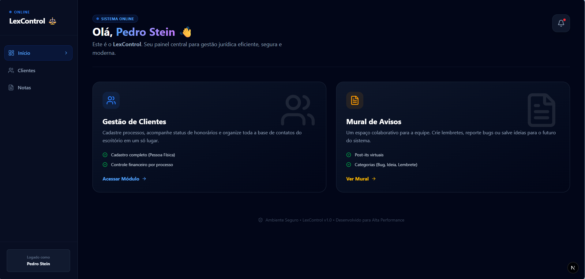
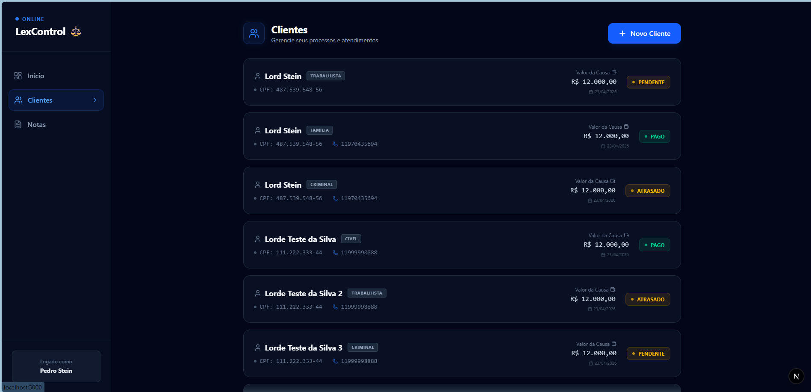
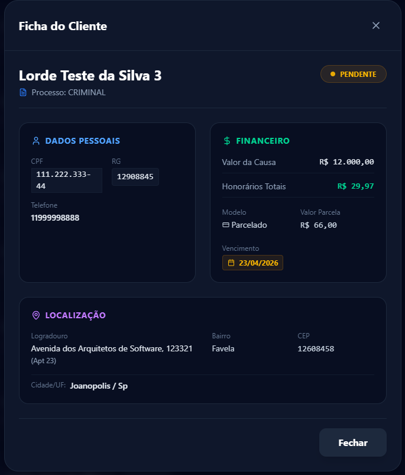
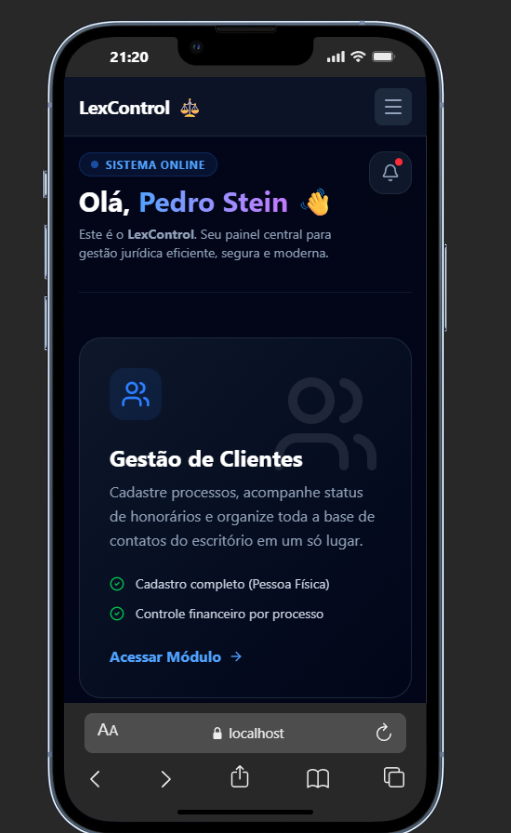
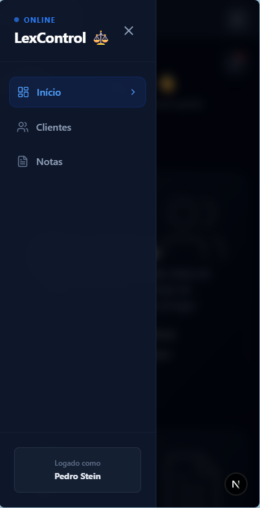
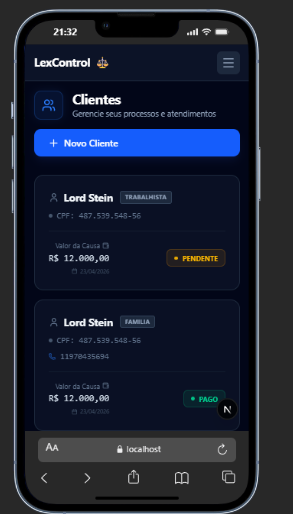
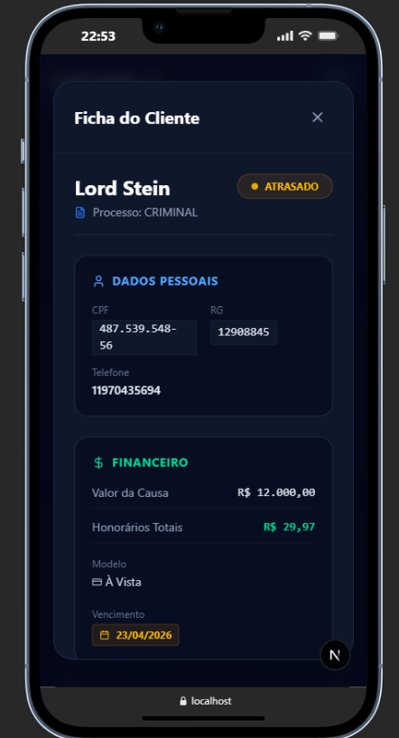

<div align="center">
  <h1>⚖️ LexControl Ecosystem</h1>
  <p><strong>Engenharia de Software de Alta Performance para Gestão Jurídica</strong></p>
  <p>
    
    
    
    
  </p>
  <p><em>O LexControl é um ecossistema completo para escritórios de advocacia que buscam automação financeira e controle processual. Desenvolvido com arquitetura modular, seguindo rigorosamente os princípios de Clean Code e SOLID.</em></p>
</div>

---

## 💻 Experiência Desktop (Gestão e Autenticação)

<div align="center">
  <a href="https://github.com/Nezo25/lexcontrol-api/blob/master/docs/gifs/gif_final.mp4" target="_blank">
    
  </a>
</div>
<br/>

<table align="center" width="100%">
  <tr>
    <td align="center" width="50%"><b>Dashboard Principal</b></td>
    <td align="center" width="50%"><b>Lista de Clientes</b></td>
  </tr>
  <tr>
    <td></td>
    <td></td>
  </tr>
  <tr>
    <td align="center" colspan="2"><b>Ficha Detalhada do Cliente (Desktop)</b></td>
  </tr>
  <tr>
    <td align="center" colspan="2"></td>
  </tr>
</table>

---

## 📱 Mobile-First Design (Operação em Campo)

<div align="center">
  <a href="https://github.com/Nezo25/lexcontrol-api/blob/master/docs/gifs/projeto_celular.mp4" target="_blank">
    
  </a>
  &nbsp;&nbsp;
  <a href="https://github.com/Nezo25/lexcontrol-api/blob/master/docs/gifs/FichaDoClienteMobile.webm" target="_blank">
    
  </a>
</div>
<br/>

### 1. Visão Geral (Home, Menu e Lista)
<table align="center" width="100%">
  <tr>
    <td align="center" width="33%"></td>
    <td align="center" width="33%"></td>
    <td align="center" width="33%"></td>
  </tr>
</table>

### 2. Interações e Alertas (Detalhes)
<table align="center" width="100%">
  <tr>
    <td align="center" width="33%"><b>Assistente Virtual</b></td>
    <td align="center" width="33%"><b>Ficha do Cliente</b></td>
    <td align="center" width="33%"><b>Notificações</b></td>
  </tr>
  <tr>
    <td align="center"></td>
    <td align="center"></td>
    <td align="center"></td>
  </tr>
</table>

---

## 🚀 Stack Tecnológica de Elite

* **Backend:** Java 25, Spring Boot 4.0, MySQL 8.0, Flyway Migrations, Spring Security.
* **Frontend:** Next.js 15 (App Router), React 19, Tailwind CSS, TanStack Query.

---

## ⚙️ Como Executar (Instalação e Setup Local)

O projeto utiliza **Git Worktrees** para gerenciar múltiplos contextos em pastas separadas, evitando conflitos de arquivos e agilizando o desenvolvimento.

### Passo 1: Automação DevOps (Script Python)
1. Coloque o arquivo `setup_lexcontrol.py` na pasta raiz do seu diretório de projetos.
2. No terminal, execute o comando abaixo para instanciar as pastas separadas (Main, Front e Back):
```bash
python setup_lexcontrol.py
